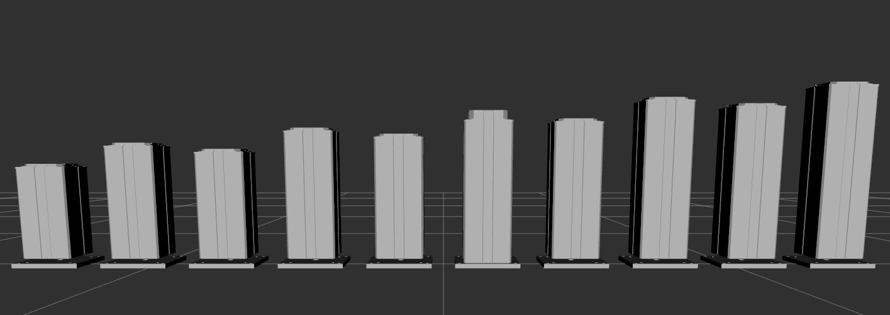

# Ewellix Driver

ROS2 driver for the Ewellix TLT lifts.



## Setup
Add user to `dialout` group to ensure the driver has permissions to access the serial device.
```
sudo usermod -a -G dialout UserName
```

## Ewellix Node Usage
Run the driver:
```
ros2 run ewellix_driver ewellix_node
```

Parameters:
  - `port`: Path to device. By default, `/dev/ttyUSB0`.
  - `baud`: Baud rate, on most TLT it should be set to `38400`
  - `timeout`: Timeout in milliseconds to wait for response from SCU. By default, `1000` ms.
  - `joint_count`: Number of actuators. By default, `2`.
  - `conversion`: Encoder ticks per meter. Varies depending on lift model. On the 500mm model, `3225` encoder ticks per meter.
  - `rated_effort`: Rated force of lift. On the 500mm model, `2000` N.
  - `tolerance`: Distance from commanded position to consider within bounds. By default `0.005` meters.
  - `frequency`: Publishing loop rate. By default, `10 Hz`.

Running the driver with parameters:
```
ros2 run ewellix_driver ewellix_node --ros-args -p port:=/dev/ttyUSB0
```

Moving the lift:
```
ros2 topic pub /command ewellix_interfaces/msg/Command "ticks: 0
meters: 0.0"
```
`ticks` range from 0 to 865.

`meters` range from 0.0 to max height defined by the model.
If both are defined, ticks takes priority over meters.

## Ewellix Hardware Interface Usage
If the `generate_ros2_control_tag` is enabled in the `ewllix_lift` macro defined in *ewellix_macro.xacro*, the hardware interface will be loaded by the controller manager.

Using the `position_controllers/JointGroupPositionController` send a position command to the lift's actuators.

Moving the lift:
```
ros2 topic pub /lift_position_controller/commands std_msgs/msg/Float64MultiArray "layout:
  dim: []
  data_offset: 0
data: [0.0]"
```
`data` list specifies the desired position of the lower and upper joint.
> Note, the command sent is applied to both actuators. Therefore, on the TLT500, send a 0.25 command to extend the lift to 500mm.

## Example: Visualization
To visualize a model of the lifts in RViz, use the example `rviz.launch.py`.

```
ros2 launch ewellix_examples rviz.launch.py
```

By default, the TLT x25 (2000N, 500mm) model is selected.

To change the model, select a different parameter file. The parameter files can be found in the [config](./ewellix_description/config/) directory of the description package.

For example, to visualize the TLT x13 model, navigate to the `ewellix_lift` directory and run the following command:
```
ros2 launch ewellix_examples rviz.launch.py lift_parameters:=$PWD/ewellix_description/config/tlt_x13.yaml
```


## Example: Simulation without MoveIt!
To simulate the lift with a simple controller, use the defaults on the `simulation.launch.py`.

```
ros2 launch ewellix_examples simulation.launch.py
```

To change the model, the same parameter is available as in the visualization example:
```
ros2 launch ewellix_examples simulation.launch.py lift_parameters:=$PWD/ewellix_description/config/tlt_x13.yaml
```

By default, the controller loaded to the ROS 2 control plugin is the `JointGroupPositionController` using the [`jpc.yaml`](./ewellix_description/config/control/jpc.yaml).


## Example: Simulation with MoveIt!
To simulate the lift with the `JointTrajectoryController` compatible with MoveIt!, use the following parameters:

```
ros2 launch ewellix_examples simulation.launch.py controller_file:=jtc.yaml launch_moveit:=true
```

## References
1. [Ewellix serial control unit (SCU) installation, operation, and maintenance manual.](https://medialibrary.ewellix.com/asset/16223)
2. [Ewellix RS232 interface for serial control unit.](https://medialibrary.ewellix.com/asset/16222)
3. [Ewellix TLT lifting columns](https://medialibrary.ewellix.com/asset/16207)
